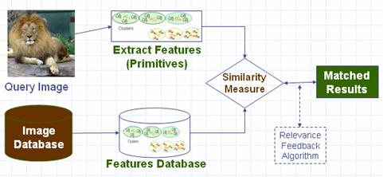

# CBIR

## A simple implementation of deep learning based cbir system

  

Steps:
 1. Pretrain a classfication model.
 2. Use the pretrained model to extract features and construct a feature database.
 3. Input target image into the network to get features and compute cosine similarity with images in the database.
 4. Visualize the results.

Tools:
 - Deep learning framework: pytorch 0.4
 - Model: resnet-101
 - Dataset: cifar-100
 	- use training set to build feature database
 	- test set as source of target images
